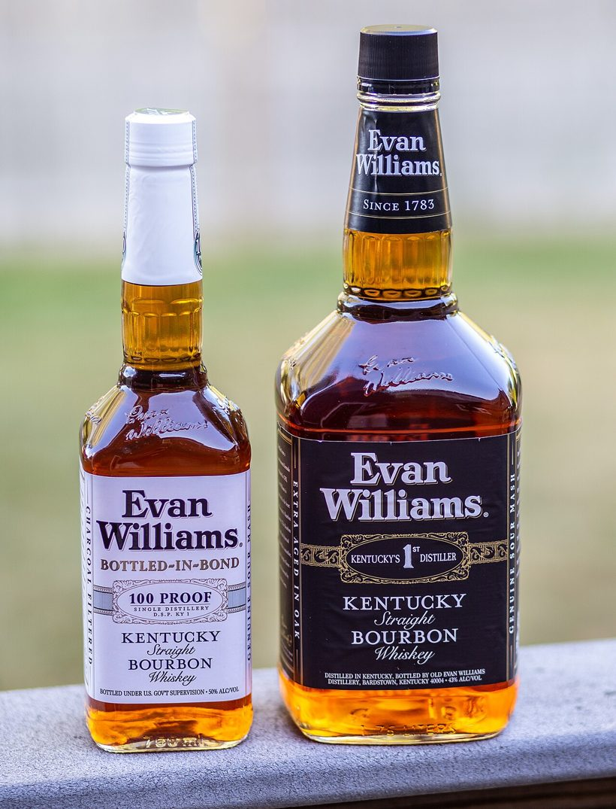
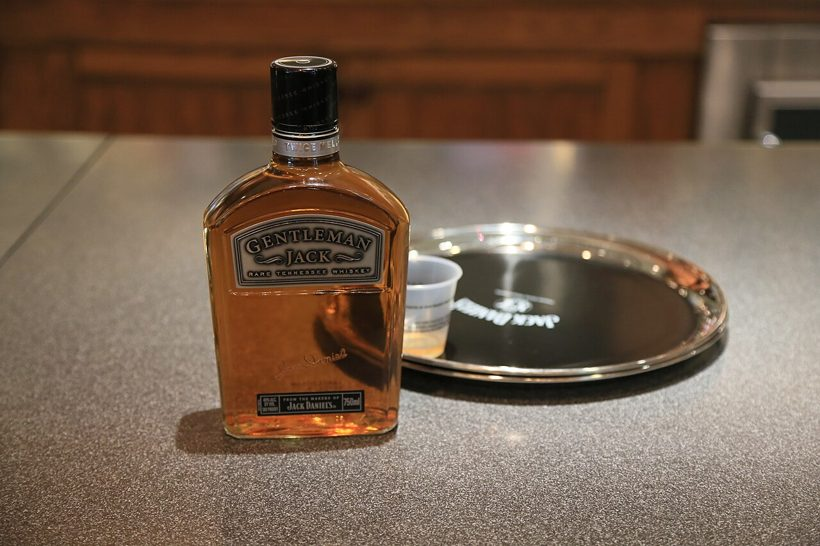
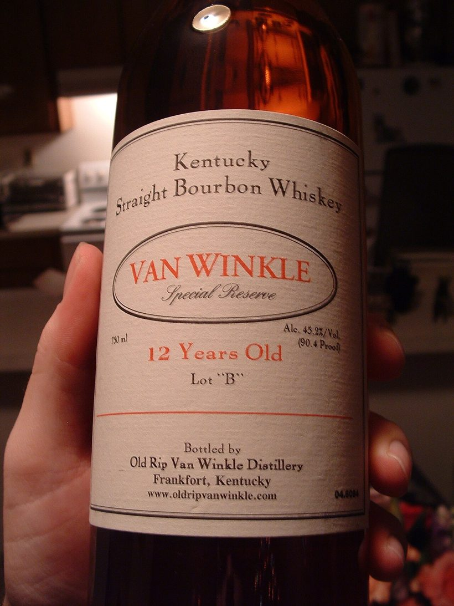
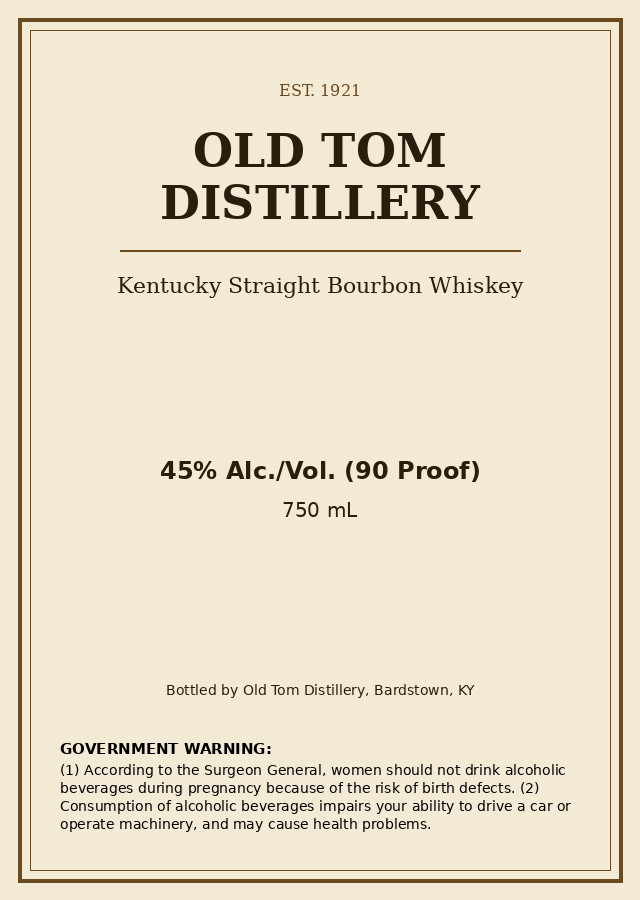
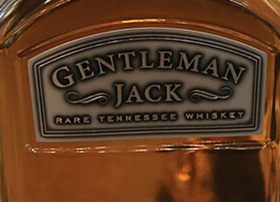

# Real-world findings — results without running the app

The verifier was tested against the **live deployment** using **actual product photographs**
(Wikimedia Commons), driven through a real browser with Puppeteer — each photo uploaded and
the on-screen verdict recorded, once with the cloud engine (`gpt-4o`) and once with the in-app
**"Simulate agency firewall"** toggle (offline OCR). Harness:
[`../realtest/drive.js`](../realtest/drive.js).

The photographs are deliberately unforgiving — angles, glare, curved labels, dim light, small
text. The tables below show what each engine returned, so the results are visible without
standing the application up.

---

## A. Reading real product photos — cloud vs. offline

### 1. Evan Williams — two bottles, angled, reflective glass, script font

| Application value | Cloud `gpt-4o` | Offline OCR |
|---|---|---|
| Brand: **Evan Williams** | *Evan Williams* (exact) ✅ | not found ❌ |
| Class: **Kentucky Straight Bourbon Whiskey** | exact ✅ | not found ❌ |
| Government Warning | not present (front label) ❌ | not present ❌ |

**Verdict: Needs attention** (warning not visible). The cloud engine read both fields off
curved, script-font labels; plain OCR recovered nothing.

### 2. Gentleman Jack — small label, shot across a counter

| Application value | Cloud `gpt-4o` | Offline OCR |
|---|---|---|
| Brand: **Gentleman Jack** | exact ✅ | not found ❌ |
| Class: **Tennessee Whiskey** | "Rare Tennessee Whiskey" ✅ | not found ❌ |
| Net contents: **750 mL** | matches ✅ | not found ❌ |
| ABV: **40%** | *"no alcohol content could be read"* ⚠️ | not found ❌ |
| Government Warning | not present (front label) ❌ | not present ❌ |

**Verdict: Needs attention.** Note that `gpt-4o` **failed honestly** on the ABV — it reported
that it could not read the value rather than inventing one, which is the correct behaviour for
a compliance tool.

### 3. Old Rip Van Winkle — handheld, dim light, serif type — *the case for a human in the loop*

| Application value | Cloud `gpt-4o` read | Result |
|---|---|---|
| Brand: **Van Winkle** | *Van Winkle Special Reserve* | **Review** — see below |
| Class: **Kentucky Straight Bourbon Whiskey** | exact | ✅ |
| ABV: **45.2%** | *45.2% Vol. (90.4 Proof)* | ✅ |
| Net contents: **750 mL** | *750 ml* | ✅ |
| Government Warning | not present (front label) | ❌ |

The application named the brand *"Van Winkle"*; the label prints *"Van Winkle Special
Reserve."* An exact-match rule would **fail** an obviously-related product; a loose fuzzy-match
might **wave through** a different one. Because this is an official record where a small
discrepancy can be disqualifying, the tool does neither — it returns **Review** with a
plain-language prompt, and the agent decides. (It does **not** auto-pass: *"Crown"* vs
*"Crown Royal"* are different products.)

---

## B. The Government Warning, read and verified by **both** engines

The photographs above are front-label shots, so the (back-of-bottle) warning is absent. On a
clean label that *does* carry the warning — representative of the print-ready artwork COLA
actually stores — **both engines detect and verify it**:

| Engine | Warning detected | Heading ALL-CAPS | Wording | Result |
|---|---|---|---|---|
| Cloud `gpt-4o` | yes | yes | matches statute | ✅ Pass |
| Offline OCR | yes — transcribed **verbatim** | yes | matches statute | ✅ Pass |

This is the positive counterpart to the photo tests: the warning check is the part where the
offline engine is fully competent, because clean artwork is high-contrast and flat.

---

## C. Cropping the label changes the OCR result

The offline engine runs on the **whole image**, which is most of why it fails on photos. A
controlled crop experiment ([`realtest/`](../realtest/)) isolates the effect — the Gentleman
Jack label, perfectly legible once cropped and enlarged:

| Input to Tesseract | Result |
|---|---|
| Whole photo | noise |
| Cropped to label (Gentleman Jack, embossed silver) | still noise — low contrast |
| Cropped to label (Old Rip Van Winkle, cream/serif) | recovers "Kentucky", "Special Reserve" |

So cropping is necessary but not sufficient: low-contrast/embossed lettering needs a scene-text
OCR engine or a local vision model. The full upgrade path is in
[ENGINEERING-NOTES.md](ENGINEERING-NOTES.md#offline-ocr-why-it-fails-on-photographs).

---

## What the testing established

1. **Cloud vision far outperforms plain OCR on photographs;** OCR is fully competent on clean
   artwork. The offline path is a free, always-available fallback, not an equal — and the
   upgrade path is concrete.
2. **No false approvals.** Every front-label photo was correctly flagged (warning not visible),
   as an agent would flag an incomplete submission.
3. **The machine triages; the human decides.** Exact matches auto-clear; any residual
   discrepancy is escalated, never silently passed.
4. **Single front-label photos are insufficient evidence** — the mandatory warning lives on the
   back. This motivated the multiple-images-per-product capability (see the project
   [README](../README.md#recommendation-require-multiple-images-per-product)).

---

## Image credits

Test photographs are used under their Creative Commons licences (not redistributed as part of
the application; shown here for documentation).

- *Evan Williams bottles* — Kenneth C. Zirkel, [CC BY-SA 4.0](https://creativecommons.org/licenses/by-sa/4.0/) ([source](https://commons.wikimedia.org/wiki/File:Evan_Williams_white_label_and_black_label_whiskey_bottles.jpg))
- *Gentleman Jack* — Bruce Tuten, [CC BY 2.0](https://creativecommons.org/licenses/by/2.0/) ([source](https://commons.wikimedia.org/wiki/File:Gentleman_Jack_Whiskey_(8743148250).jpg))
- *Old Rip Van Winkle* — Joe Hall, [CC BY 2.0](https://creativecommons.org/licenses/by/2.0/) ([source](https://commons.wikimedia.org/wiki/File:Old_Rip_Van_Winkle_Whiskey_301243232.jpg))
